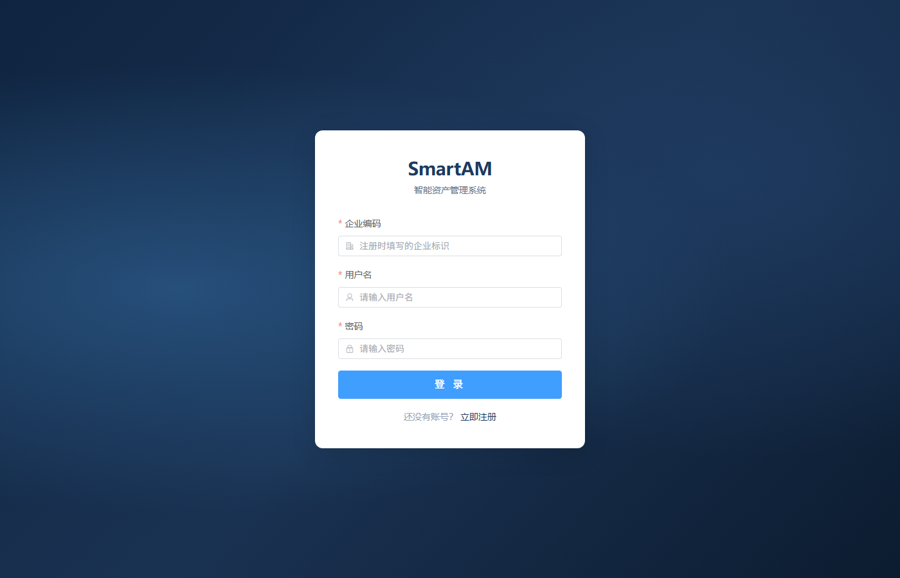
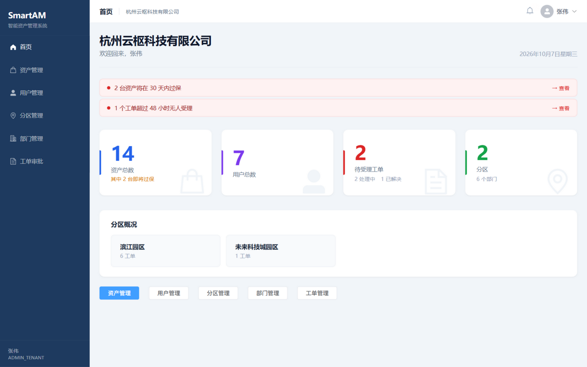
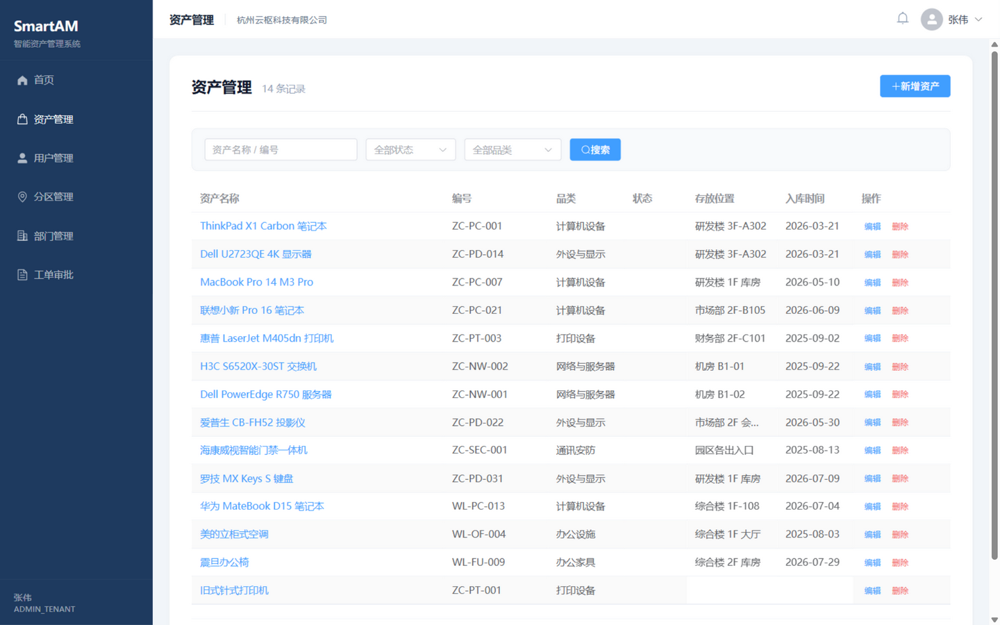
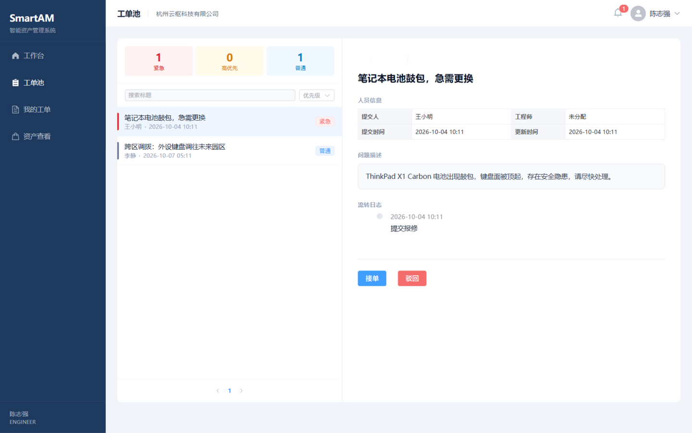
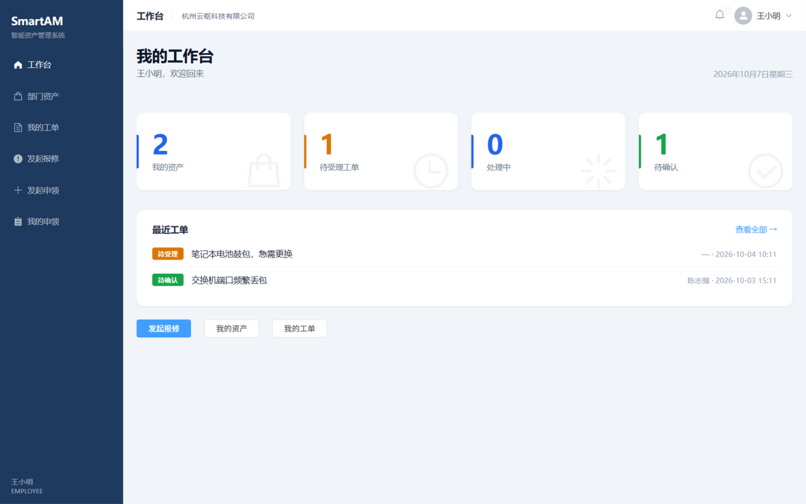
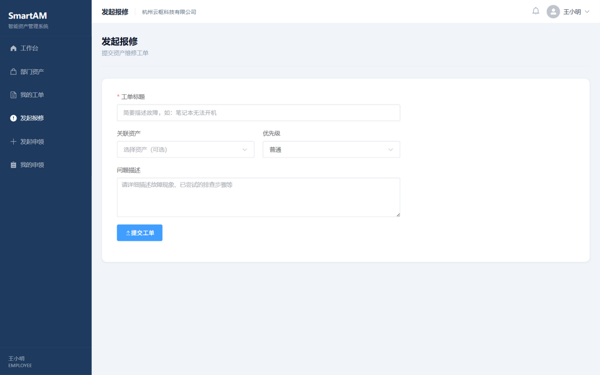
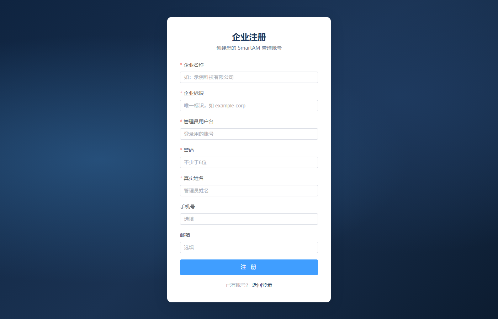
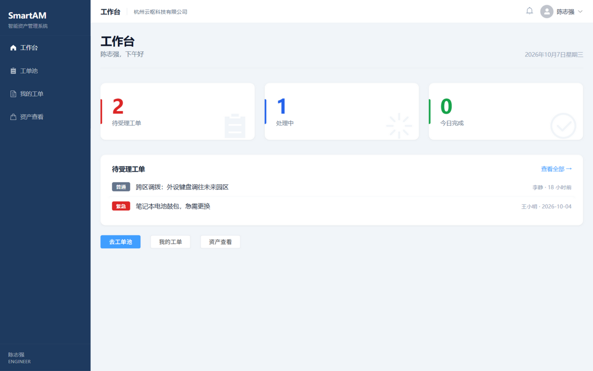

# SmartAM Web — 智能资产管理系统前端


SmartAM 是一套**多租户**的智能资产管理系统，本项目是它的 Web 前端。系统围绕企业资产的完整生命周期（入库 → 领用 → 维修 → 报废）展开，按**租户管理员 / 分区管理员 / 员工 / 工程师**四种角色划分功能，支持报修工单闭环与资产申领审批，各角色登录后进入各自的独立视图。

## 界面预览

| | |
|---|---|
|  |  |
| **登录**（企业编码 + 账号密码，JWT 认证） | **管理员工作台**（资产/用户/工单概览、过保与超时提醒、分区概况） |
|  |  |
| **资产管理**（搜索筛选、状态标签、新增/编辑抽屉） | **工程师工单池**（优先级分栏、在线接单） |
|  |  |
| **员工工作台**（我的资产、工单进度、最近工单） | **发起报修**（关联资产、优先级、问题） |
|  |  |
| **企业注册**（首次使用，创建租户与管理员） | **工程师工作台**（待受理/处理中/今日完成） |

## 功能特性

**管理端（ADMIN_TENANT / ADMIN_REGION）**
- 数据看板：资产/用户/工单核心指标，30 天内过保、48 小时无人受理等异常提醒，分区概况
- 资产管理：新增/编辑/删除，按名称编号、状态、品类检索，查看资产变更日志
- 用户管理：按角色创建分区管理员、工程师、员工，重置密码、启用/停用
- 分区管理 / 部门管理（部门支持树形层级），租户管理员专属
- 工单审批：查看并处理工单，处理异常单据

**员工端（EMPLOYEE）**
- 工作台：我的资产、工单状态统计、最近工单
- 部门资产：查看本部门资产
- 发起报修：关联资产 + 优先级提交维修工单；我的工单跟踪进度、对已解决工单确认评价
- 发起申领：申领/调拨/报废申请；我的申领查看审批进度

**工程师端（ENGINEER）**
- 工作台：待受理、处理中、今日完成统计
- 工单池：按优先级浏览待受理工单，在线接单
- 我的工单：接单 → 提交解决方案 → 驳回，全流程操作；资产查看

**通用**
- 个人设置（修改资料、修改密码）、消息通知（工单/申领/资产三类消息，未读角标）
- 路由守卫：未登录跳转登录页，按角色限制访问范围，登录后自动进入对应角色首页

## 技术栈

| 分类 | 选型 |
|---|---|
| 框架 | Vue 3.5（`<script setup>` 组合式 API）+ TypeScript |
| 构建 | Vite 8 |
| UI | Element Plus + `@element-plus/icons-vue`，全局样式 Sass |
| 状态管理 | Pinia（登录态持久化到 localStorage） |
| 路由 | Vue Router 4（History 模式 + 角色路由守卫） |
| 网络请求 | Axios（统一响应拦截、Token 注入、401 自动登出） |

## 快速开始

```bash
# 环境要求：Node.js ^20.19.0 或 >=22.12.0

git clone https://github.com/Bb-02/SmartAM-web.git
cd SmartAM-web
npm install
npm run dev
```

浏览器访问 http://localhost:5173。

前端通过 Vite 代理访问后端（开发环境 `.env.development` 中 `VITE_API_BASE_URL=/api`，代理到 `http://localhost:8080`），因此需要同时运行 SmartAM 后端服务；若后端地址不同，修改 `vite.config.ts` 中 `server.proxy` 的 `target` 即可。

## 角色与路由

| 角色 | 默认首页 | 菜单 |
|---|---|---|
| 租户管理员 `ADMIN_TENANT` | `/admin/tenant/dashboard` | 首页、资产管理、用户管理、分区管理、部门管理、工单审批 |
| 分区管理员 `ADMIN_REGION` | `/admin/region/dashboard` | 首页、资产管理、用户管理、工单审批（仅本分区） |
| 工程师 `ENGINEER` | `/engineer/dashboard` | 工作台、工单池、我的工单、资产查看 |
| 员工 `EMPLOYEE` | `/employee/dashboard` | 工作台、部门资产、我的工单、发起报修、发起申领、我的申领 |

认证方式为 JWT Bearer Token：登录成功后 Token 存入 localStorage，由 Axios 拦截器统一注入请求头；收到 401/403 自动清除登录态并跳回登录页。企业首次使用需先在注册页创建租户（生成企业编码），再用管理员账号登录。

## 目录结构

```
src/
├── api/           # 接口封装（auth / assets / work-orders / statistics ...）
├── assets/        # 全局样式
├── components/    # 公共组件
├── composables/   # 组合式函数（数据字典 useDict）
├── config/        # 角色菜单与首页配置
├── layouts/       # 主布局（侧边栏 + 顶栏 + 消息角标）
├── router/        # 路由表与角色守卫
├── stores/        # Pinia 状态（登录态）
├── types/         # TypeScript 类型定义（与后端 DTO 对齐）
├── utils/         # localStorage 封装
└── views/         # 页面，按角色分目录
    ├── admin/     # 管理端（看板、资产、用户、分区、部门、工单）
    ├── employee/  # 员工端（工作台、资产、工单、报修、申领）
    ├── engineer/  # 工程师端（工作台、工单池、我的工单、资产查看）
    ├── login/     # 登录
    └── register/  # 企业注册
```

## 构建与部署

```bash
npm run build    # 类型检查（vue-tsc）+ 打包，产物在 dist/
npm run preview  # 本地预览构建产物
```

生产环境建议将 `dist/` 部署到 Nginx 等静态服务器，并把 `/api` 反向代理到后端服务（与开发时代理行为一致），同时为 History 路由配置回退到 `index.html`。
